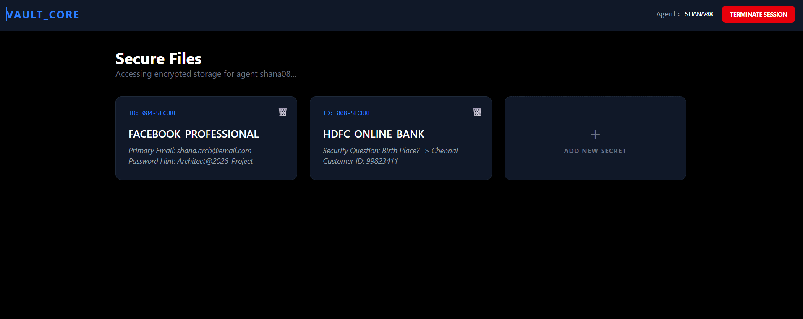

<div align="center">

# 🔐 SECRET VAULT : Secure Secret Management


*A Secure Full-Stack Sentinel for Encrypted Credential Management*
</div>

## 📖 Project Overview

*SECERET VAULT* is a professional-grade security application built with a *Java 17/Spring Boot 3* backend and a *React 18* frontend. It leverages *JWT* for stateless, secure communication and *Redux Toolkit* for robust client-side state management. The project demonstrates advanced full-stack concepts, including solving Hibernate infinite recursion, implementing custom Security Filters, and building a responsive, high-performance "Agent Dashboard" with *Tailwind CSS*.

---

## 📸 Dashboard Preview



---

## 🛠️ Core Tech Stack

### **Frontend (The "Agent" Interface)**
* **React 18 & Tailwind CSS:** Modern, dark-themed responsive UI.
* **Redux Toolkit:** Centralized state management for session handling.
* **Lucide React:** Clean, minimalist iconography for a professional look.

### **Backend (The "Vault" Core)**
* **Spring Boot 3:** Robust MVC architecture.
* **Spring Security & JWT:** Stateless authentication ensuring zero session leaks.
* **Spring Data JPA:** Optimized ORM for PostgreSQL interactions.

---

## 🔐 Security Implementation
* **Stateless Auth:** Every request is validated via JSON Web Tokens (JWT).
* **Encryption:** Sensitive data is handled with industry-standard hashing before storage.
* **CORS Policy:** Strict origin filtering to prevent unauthorized API calls.


---

---

## 🔒 Security Protocols & Architecture

This section outlines the multi-layer security approach implemented to protect sensitive agent data within **SECRET_VAULT**:

### 1. Stateless Authentication (JWT)
* **Secure Handshake**: The system utilizes **JSON Web Tokens (JWT)** to manage authentication, ensuring no sensitive session data is stored on the server side.
* **Bearer Token Validation**: Every outgoing request from the **React** frontend is configured to include a valid JWT in the `Authorization` header.
* **Spring Security Filter**: A custom filter in the **Spring Boot** backend intercepts every request to validate the token signature and verify that the agent is authorized to access their specific vault.

### 2. Client-Side Protection (Redux Toolkit)
* **Protected State**: Agent credentials and tokens are managed within a centralized **Redux** store, preventing sensitive data from being scattered across the component tree.
* **Session Termination**: The "Terminate Session" feature triggers a global state reset, immediately purging all authentication data from the browser's memory.
* **Route Guards**: Redux state serves as a gatekeeper for frontend routes, preventing unauthenticated users from accessing the **Dashboard** layout.

### 3. Data Integrity & Persistence
* **Bidirectional Relationship Mapping**: To prevent data leaks and API crashes, the project utilizes `@JsonBackReference` and `@JsonIgnore` annotations within the **Java** entities to safely handle complex **Hibernate** relationships.
* **Relational Isolation**: Each secret is strictly mapped to a unique `user_id` in the **PostgreSQL** database. This ensures strict data isolation where users can only access records associated with their own account.

---

## ⚙️ Quick Start

### 1. Prerequisites
* JDK 17+
* Node.js v18+
* PostgreSQL Instance

### 2. Backend Setup
```bash
cd backend
# Update application.properties with your DB credentials
./mvnw spring-boot:run
```

###3. Frontend Setup
```bash
cd frontend
npm install
npm start
```

####Project Structure
```
├── backend/            # Spring Boot Project
├── frontend/           # React Project (Vite/CRA)
├── .gitattributes      # Repository Language Optimization
└── README.md           # Professional Documentation
`````
## Contact

For any inquiries or feedback, feel free to reach out:

- *Email:* [reachfaizal08@gmail.com](reachfaizal08@gmail.com)
- *GitHub:* [faizal08](https://github.com/faizal08)
